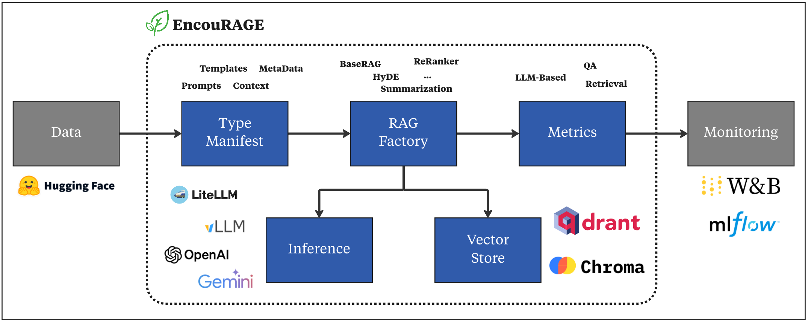
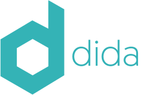

<p align="center">
  <br />
  <span style="font-size: 2em; font-weight: bold;">EncouRAGe</span>
</p>
<p align="center">
  <b>the all-in one solution for evaluate RAG methods</b>. <br /> <br />
  
  
  
  <br />
  
  
  
</p>

---

## About

This repository provides a flexible library for running Retrieval-Augmented Generation (RAG) methods and evaluate them.
It is designed to be modular and extensible, allowing users to easily integrate their own data and test them on RAG methods and calculate metrics.

<p align="center">
  <br />
</p>


--- 
## Overview


The following libraries are used to provide the core functionality:

For Inference Runners:
- 🏃 **[vllm](https://github.com/vllm-project/vllm)**
  - A fast and flexible framework for LLM inference.
- 🚈 **[litellm](https://github.com/huggingface/transformers)**
  - A popular library for LLM proxy and inference.

For Templates:
- ⚙️ **[jinja2](https://github.com/pallets/jinja)**
  - Offers a template engine for dynamic prompt generation.

For Evaluation Metrics:
- 📊 **[evaluate](https://github.com/huggingface/evaluate)**
  - A library for easily accessing and computing a wide range of evaluation metrics.

For Vector Databases:
- 🔄 **[chroma](https://github.com/chroma-core/chroma)**
  - Strong in-memory vector database for efficient data retrieval.
- 🧭 **[qdrant](https://github.com/qdrant/qdrant)**
  - Supports robust vector search for efficient data retrieval.

---

### 🚀 Getting Started

```python
pip install encourage-rag
```

To initialize the environment using `uv`, run the following command:

```bash
uv sync
```
--- 

### ⚡ Usage Inference Runners

For understanding how to use the inference runners, refer to the following tutorials:


- [BatchInferenceRunner](./docs/batch_inference.md)

### 🔍 RAG Methods

Encourage provides several RAG (Retrieval-Augmented Generation) methods to enhance your LLM responses with relevant context:

- [Overview of RAG Methods](./docs/rag_methods.md)

### 📊 Evaluation Metrics

Encourage offers a comprehensive set of metrics for evaluating LLM and RAG performance:

- [Metrics Overview](./docs/metrics_overview.md) - Table of all available metrics
- [Metrics Explanation](./docs/metrics_explanation.md) - Detailed explanations and formulas
- [Metrics Tutorial](./docs/metrics_tutorial.md) - Step-by-step guide to using metrics

### ⚙️ Custom Templates

To use a custom template for the inference, follow the steps below:

- [Create a custom template](./docs/templates.md)

### 📈 Model Tracking

For tracking the model performance, use the following commands:

- [Track the model](./docs/mlflow.md)

---
### Contributing

We welcome and value any contributions and collaborations. Please check out [Contributing to encourage](https://docs.vllm.ai/en/latest/contributing/index.html) for how to get involved.

---

### Credits

This project is developed as cooperation project by the [HCDS](https://www.hcds.uni-hamburg.de) at the University of Hamburg and [dida GmbH](https://www.dida.do/).

<p align="center">
  <span style="margin-right: 100px;">
    
  </span>
  <span>
    
  </span>
</p>